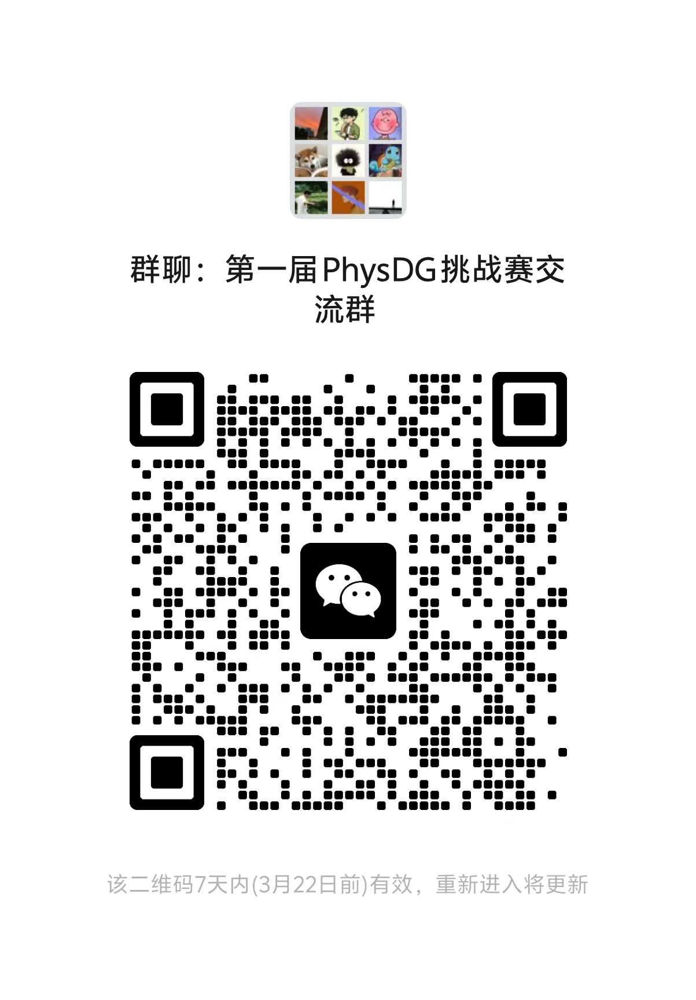

# PHYSDG-2026-DOMAIN-GENERALIZED-REMOTE-PHYSIOLOGICAL-MEASUREMENT-CVPR2026

Participating teams that have not yet joined the competition WeChat groups are requested to scan the codes below to join the following two WeChat groups as soon as possible.

* PhysDrive_Test.zip: This file is the sample for uploading test results of the Stage 2. All teams are required to compress their own test results into the same format as this file and submit the .zip file to the competition website.
* MMPD_Train_List.txt: This file contains the sample indices of 50% of the MMPD dataset. All participating teams must use the samples in this file for model training.
* MMPD_Test_List.txt: This file contains the sample indices of the remaining 50% of the MMPD dataset. All participating teams must use the samples in this file for model testing.
* MMPD_Test_Res.zip: This file is the sample for uploading test results of the Stage 1. All teams are required to compress their own test results into the same format as this file and submit the .zip file to the competition website.
